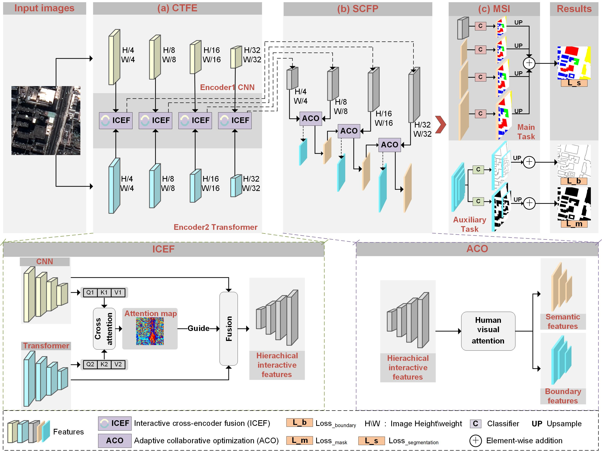

# CTCFNet

Official Pytorch Code base for "Building Type Classification Using CNN-Transformer Cross-Encoder Adaptive Learning From Very-High-Resolution Satellite Images"
[Project](https://github.com/zsfaff/CTCFNet)

## Introduction
Building type information indicates the functional properties of buildings and plays a crucial role in smart city development and urban socio-economic activities. Existing methods for classifying building types often face challenges in accurately distinguishing buildings between types while maintaining well-delineated boundaries, especially in complex urban environments. This study introduces a novel framework, i.e., CNN-Transformer cross-attention feature fusion network (CTCFNet), for building type classification from very-high-resolution remote sensing images. CTCFNet integrates CNNs and Transformers using an interactive cross-encoder fusion (ICEF) module that enhances semantic feature learning and improves classification accuracy in complex scenarios. We develop an adaptive collaboration optimization (ACO) module that applies human visual attention mechanisms to enhance the feature representation of building types and boundaries simultaneously. To address the scarcity of datasets in building type classification, we create two new datasets: the urban building type (UBT) dataset and the town building type (TBT) dataset. We conclude that CTCFNet effectively addresses the challenges of high interclass similarity and intraclass inconsistency in complex scenes, yielding results with well-delineated building boundaries and accurate building types.

## Method
<p align="center">
  
</p>

## Data
We created two building typ classification datasets, urban building type dataset (UBT) dataset and Town building type (TBT) dataset, from GF-2 satellite images (of 1m spatial resolution) covering nine areas in Fujian Province, China. The building type classification system includes five building types, complex buildings, factury building, apartment-type buildings, high-density residential buildings and detached buildings.
<p align="center">
  
  
  
</p>
### Data Format

```
inputs
└── <train>
    ├── image
    |   ├── 001.png
    │   ├── 002.png
    │   ├── 003.png
    │   ├── ...
    |
    └── label
    |   ├── 001.png
    |   ├── 002.png
    |   ├── 003.png
    |   ├── ...
    └── boundary
    |   ├── 001.png
    |   ├── 002.png
    |   ├── 003.png
    |   ├── ...
└── <val>
    ├── image
    |   ├── 001.png
    │   ├── 002.png
    │   ├── 003.png
    │   ├── ...
    |
    └── label
    |   ├── 001.png
    |   ├── 002.png
    |   ├── 003.png
    |   ├── ...
    └── boundary
    |   ├── 001.png
    |   ├── 002.png
    |   ├── 003.png
    |   ├── ...
```
For test datasets, the same structure as the above.
